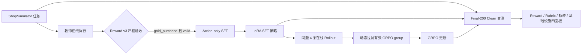

# 购物 Agent RL 项目导学

> 项目：Shopping GRPO / ShopSimulator Agent 后训练与评测  
> 学习目标：能从环境交互、数据、SFT、GRPO、Reward 和评测六条链路解释项目，并能指出边界与风险。  
> 使用边界：本文按“开源项目复现与深度学习材料”整理。除非你确实完成了相应复现、修改或实验，否则不能把仓库作者与贡献者的工作写成个人成果。

## 0. 先记住唯一主线

```text
Baseline → SFT → GRPO → Evaluation
```

项目的运行契约固定为 ShopSimulator Environment v2.1、Reward v3、observation v2、tool schema v2。训练数据不能与 `data/evaluation/tasks.jsonl` 重叠；严格成功必须是环境完整终止、`reward_type=gold_purchase` 且 `reward_valid=true`。学习时不要被仓库中的研究草稿或历史实验带偏，面试回答始终回到这条正式主线。

## 1. 前置知识表

| 知识 | 需要掌握到什么程度 | 为什么重要 | 推荐先看 |
|---|---|---|---|
| LLM Tool Calling | 理解 assistant 生成工具调用、tool 返回 observation、再继续决策的消息结构 | 项目的训练样本不是普通问答，而是多轮工具轨迹 | `src/shopping_grpo/environment/tools.py` |
| Agent 环境 | 理解 reset、step、done、terminal result、动作合法性 | Reward 只在环境真实执行后产生 | `src/shopping_grpo/environment/client.py`、`evaluation/rollout.py` |
| SFT 与标签掩码 | 知道 causal LM 的 labels、`-100`、chat template、LoRA | 项目只训练 assistant token，不拟合用户和环境文本 | `training/sft/dataset.py` |
| PPO/GRPO | 理解同一 prompt 多次采样、组内相对优势、无 critic 的含义 | 动态采样只保留组内奖励有差异的 group | `training/grpo/dynamic_sampling.py` |
| 奖励设计 | 区分硬门槛、软匹配、终局类型、无效奖励 | 避免把“购买了”误当作严格成功 | `docs/reward-v3.md`、环境 `engine/reward.py` |
| 数据隔离 | 理解 task-ID 级切分、盲测集、哈希校验、数据泄漏 | Final-200 Clean 不得参与训练、调参和 checkpoint 选择 | `evaluation/blind_guard.py` |
| 离线评测 | 理解固定分母、配对比较、LLM Judge 与代码硬检查分工 | 项目不把多类指标压成一个不可解释总分 | `docs/evaluation.md` |

## 2. 项目技术定位

这是一个面向长程购物任务的 Agent 后训练项目。模型需要在 ShopSimulator 中搜索商品、打开候选、查看描述/属性/评论、选择规格并购买，或在充分探索后放弃。系统不是单轮分类器，而是一个最长 35 个环境动作、每一步都受当前页面约束的决策过程。

核心技术栈为 Python 3.10+、Qwen3.5-2B 基座、LoRA SFT、veRL 0.8 在线 GRPO、vLLM 异步 rollout，以及一套可审计的 Reward v3 与 Final-200 Clean 评测流水线。项目价值不只在“用了 GRPO”，更在于把数据质量、动作安全、上下文预算、奖励有效性和盲测隔离做成了可执行契约。



## 3. 最值得讲的六个支柱与学习顺序

### 支柱一：评测先行与盲测隔离

先冻结 Final-200 Clean，再构造 SFT 和 GRPO 数据。`blind_guard.py` 不依赖文件名判断，而是同时检查文件 SHA-256 和其中的 `task_id`，所以把测试数据改名也绕不过保护。最终汇总以固定 200 题为分母，缺失或基础设施无效任务不能从分母中消失。

### 支柱二：确定性 Reward 与证据有效性

Reward v3 不调用 LLM Reward Model。它先检查 category 与 budget 两个 hard gates，再按 brand、model、core functions、key options 计算软匹配，权重分别为 0.35/0.25/0.25/0.15。只有硬门槛通过且偏好全部满足，目标 ASIN 才是 `gold_purchase=1.0`；合格替代品为 `valid_alternative_purchase=0.55`。价格或关键证据不可验证时返回 `reward_unverifiable`，并令 `reward_valid=false`，不能制造训练信号。

### 支柱三：Observation 投影与动作边界治理

长商品标题和详情容易撑爆 24,576 token 上下文。投影器按页面类型设预算：搜索页 1,536、详情页 4,096、通用页 768 token；压缩后仍必须保留当前页全部商品 ASIN、可点击按钮和 footer。动作守卫只允许模型点击最新 observation 中真实出现的目标，并拒绝 schema 外参数、历史页面 ASIN、把导航按钮当规格等错误。这不是简单截断，而是“信息压缩后动作空间仍一致”的安全契约。

### 支柱四：高质量轨迹验收与 Action-only SFT

当前数据元信息记录 2,498 条教师原始轨迹，严格验收 1,026 条，固定选 1,000 条，划分为 800 条训练和 200 条验证。验收要求正常完成、包含真实 `buy_now`、Reward v3 为 `gold_purchase`、`reward_valid=true`，且工具调用合法。构造 SFT 行时移除审计用推理和终局 Reward；训练标签先全部设为 `-100`，再只打开 assistant 回合的 token，包括工具调用，避免模型学习用户指令或环境 observation 的复述。

### 支柱五：在线 GRPO 与有界动态采样

每个 prompt 在线采样 4 条轨迹，温度 0.7、top-p 0.9。GRPO 依赖组内相对差异；若四条轨迹全对、全错或终局 utility 相同，优势几乎没有信息。项目因此只保留 `terminal_utility` 有差异且没有 sampling-invalid 轨迹的 group，并最多补采 3 批；连续跳过更新也有上限，防止为追求非零方差而无限采样。当前 canonical 配置为 LoRA rank 16、学习率 1e-6、最多 500 step，Reward Model 关闭。

### 支柱六：多面板、可配对的评测

评测先将轨迹规范化并生成稳定 event ID，再做确定性硬检查；Rubric Curator 只能从代码候选中筛选需求，Trajectory Judge 只看 Actor 当时可见的轨迹，不看 Reward、Gold 或其他模型结果。最终分开报告 Reward 与终局、Query Rubric、轨迹质量、行为与基础设施四个面板，再按相同 `task_id` 比较 Baseline/SFT/GRPO 的成功状态迁移，而不是制造一个模糊总分。

## 4. 核心原理

### 4.1 为什么先 SFT 再 GRPO

Base 模型首先需要学会协议：何时搜索、怎样选择当前页 ASIN、如何查看证据、怎样选规格和合法终止。SFT 提供 workflow prior，让在线探索不再大量浪费在格式错误与非法动作上。GRPO 再利用同题多条 rollout 的结果差异，优化最终购买质量。这也是为什么主线不能跳成“直接 RL”：若策略尚未掌握工具协议，采样成本高、有效 group 少、Reward 主要反映格式故障而不是购物能力。

### 4.2 为什么只训练 assistant token

在多轮工具轨迹中，system 是规则、user 是任务、tool 是环境反馈，只有 assistant 的自然语言与工具调用是模型要学习的动作。项目用官方 chat template 分别渲染“到 generation prompt 为止”和“包含当前 assistant 回合”，用 token 公共前缀确定监督区间。这比手写 Qwen 特殊 token 更稳健，也避免对 observation 计算 loss。

### 4.3 GRPO 为什么需要奖励变化

对同一个 prompt 的一组 rollout，GRPO 使用组内相对结果构造优势。如果整组终局 utility 相同，归一化后没有可用的相对排序信号。动态采样的目标不是“只留成功样本”，而是保留有差异的组；其中可以同时包含成功、部分成功和失败。任何 infrastructure invalid、reward unverifiable 或 overlong 轨迹都会让该组被标记为 sampling invalid，以免训练把系统错误当成策略优劣。

### 4.4 为什么 Reward 与 Judge 要分开

Reward v3 是可重复执行的任务结果函数，适合训练和严格成功统计；LLM Judge 更擅长评估搜索策略、候选利用、证据核验、决策质量和终止效率。若 Judge 看到 Reward 或 Gold，会产生答案泄漏；若把 Judge 分数直接混入一个总分，又会掩盖确定性结果与主观诊断的冲突。因此项目保存二者的 disagreement，而不互相覆盖。

## 5. 关键设计决策与权衡

| 决策 | 解决的问题 | 代价或边界 |
|---|---|---|
| 固定环境与四个版本契约 | 防止训练、评测语义漂移 | 升级环境必须整体迁移，不能悄悄兼容旧协议 |
| 严格只收 `gold_purchase` | 提高示范动作可靠性 | 接受率只有 41.07%，也会降低行为多样性 |
| 按 task ID 切分并盲测保护 | 防止同题轨迹泄漏 | 还需进一步检查近重复 Query、同商品或同型号污染 |
| Observation 投影保留动作集合 | 控制上下文且不破坏可执行性 | 内容压缩仍可能丢失弱语义证据，需要分桶评估截断影响 |
| Action Guard 前置拒绝 | 防止非法动作污染环境 | Guard 降低了 Base 模型真实失败暴露，报告时应同时给出拒绝次数 |
| GRPO 动态过滤常量奖励组 | 提高有效更新的信息量 | 高成功或高失败阶段会丢掉大量组，补采增加耗时且可能改变样本分布 |
| 固定 200 题分母 | 防止只统计成功返回的任务 | 基础设施问题会降低结果，但这是更诚实的端到端指标 |
| Reward 与 Judge 四面板 | 可解释且能定位失败 | 系统更复杂，需要维护 schema、版本、hash 和覆盖率 |

## 6. 当前事实、历史结果与个人证据

### 当前仓库事实

- SFT：2,498 raw、1,026 accepted、固定使用 1,000，train/validation 为 800/200。
- GRPO 数据：train 1,000 tasks、validation 50 tasks，与当前 SFT 和 Final-200 Clean 排除重叠。
- Final-200 Clean：200 tasks，SHA-256 为 `d99112...62f5`，metadata 标记 `evaluated=false`，不能假装本地已经完成评测。
- 当前公开贡献者复现：Qwen3.8-27B 在 Final-200 Clean 上严格成功 146/200，即 73.0%，平均 Reward 0.6354。这是贡献者结果，不是你的结果。

### 历史归档实验（不能与当前 Clean 直接并列）

- Qwen3.5-2B Baseline：严格成功率 0.0%，平均 Reward -0.1105。
- LoRA SFT：严格成功率 60.5%，平均 Reward 0.4729。
- GRPO step 100：严格成功率 62.0%，购买成功率 62.5%，平均 Reward 0.5158。
- 旧实验 SFT 使用 379/49 的 train/validation；README 的硬件耗时小节又记录过 448 条训练数据。它们属于历史配方，不等于当前 800/200 数据集。

### 个人证据状态

- `待确认`：你是否独立部署过 ShopSimulator、跑通 Baseline、小样本 SFT 或短步 GRPO。
- `待确认`：你是否修改过 Reward、Guard、投影、数据处理或评测代码。
- `待确认`：你是否有自己的训练日志、commit、checkpoint、评测 JSON 和硬件耗时。
- 在这些证据产生前，简历宜写“研读并复现开源 Shopping Agent RL 项目”，不要写“设计并实现整套系统”或直接认领公开指标。

## 7. 仓库阅读计划

### 第 1 天：先跑通心智模型，不跑训练

1. `README.md`：只记主线、版本契约与当前/历史数据差异。
2. `src/shopping_grpo/environment/tools.py`：看工具 schema 如何映射为环境 action。
3. `src/shopping_grpo/environment/observation.py`：看 observation v2 如何拒绝隐藏字段。
4. `src/shopping_grpo/environment/actions.py`：看动作守卫如何限制当前页目标。
5. `src/shopping_grpo/evaluation/rollout.py`：从 reset 到 terminal 串起一次轨迹。

### 第 2 天：Reward 与终止

1. `docs/reward-v3.md`：先理解业务规则。
2. `environments/ShopSimulator/shop_env/web_agent_site/engine/reward_features.py`：看结构化要求怎样编译。
3. `.../engine/reward.py`：看 hard gates、软维度与 reward type 分支。
4. `.../engine/termination.py`：看重复循环、探索进展和终止条件。
5. `src/shopping_grpo/training/grpo/adapter/runtime.py`：看 Reward v3 如何被验证、最小化并暴露给训练。

### 第 3 天：SFT 数据与训练

1. `src/shopping_grpo/collection/sft.py`：逐条列出 acceptance reasons。
2. `src/shopping_grpo/training/sft/dataset.py`：手画 assistant-only label mask。
3. `scripts/collect_sft_data.py`：看 held-out ID 如何从采集入口排除。
4. `scripts/train_lora_sft.py`：看 LoRA、长序列、padding 和 loss-only validation。
5. `data/sft/metadata.json`：核对数量、acceptance rate 与 SHA-256。

### 第 4 天：GRPO 在线链路

1. `configs/grpo.yaml`：记录 n=4、temperature、上下文、LoRA 和动态采样参数。
2. `training/grpo/adapter/session.py`：看一条 coroutine 如何绑定一个环境租约并确保释放。
3. `training/grpo/adapter/tools.py`：看工具调用、Guard、step 与终局 Reward 如何接起来。
4. `training/grpo/adapter/agent_loop.py`：看多轮生成与 extra fields。
5. `training/grpo/dynamic_sampling.py`：自己举全同分、有方差、invalid 三组例子。

### 第 5 天：评测与简历证据

1. `docs/evaluation.md`：理解 Rubric Curator 与 Trajectory Judge 分工。
2. `evaluation/trajectory.py`：看 event ID 与 actor-visible trajectory。
3. `evaluation/contracts.py`：看 schema、rubric ID、event ID 和禁用总分校验。
4. `evaluation/blind_guard.py`：理解内容 hash + task ID 双保护。
5. `evaluation/summary.py`、`comparison.py`：看固定分母与按 task ID 配对比较。

## 8. 必备知识 Checklist

- [ ] 能在 90 秒内说清 Baseline → SFT → GRPO → Evaluation。
- [ ] 能区分 strict success、purchase success、weighted score 与 mean reward。
- [ ] 能解释 `gold_purchase` 和 `valid_alternative_purchase` 的差异。
- [ ] 能解释 `reward_unverifiable` 为什么不能当作 0 分失败样本直接训练。
- [ ] 能画出 assistant/tool 多轮消息，并说明只训练 assistant token。
- [ ] 能解释 observation 投影为何必须保持 ASIN 与按钮集合一致。
- [ ] 能举出 Action Guard 拒绝历史页面 ASIN 的例子。
- [ ] 能说明 GRPO 常量奖励组为什么没有相对优势信号。
- [ ] 能说明动态采样为何有最大补采批数和连续跳过上限。
- [ ] 能解释 Final-200 Clean 为什么只公开 task ID。
- [ ] 能解释 LLM Judge 为什么不能看到 Reward 和 Gold。
- [ ] 能明确指出历史 2B 实验与当前 Clean 贡献者复现不可直接比较。
- [ ] 能列出至少一个你亲自完成的 commit、日志或评测产物；若没有，就明确说仍在复现阶段。

## 9. 量化与验证建议

在真正写入简历前，建议按成本从低到高补个人证据：

1. **静态与单元测试证据**：跑项目测试，保存测试数量、通过率和环境版本；重点覆盖 Reward、Guard、Observation、SFT mask、dynamic sampling 与 blind guard。
2. **单题链路证据**：选非 Final-200 的任务，保存 reset、工具序列、投影元数据、终局 Reward 与失败原因，确保没有隐藏目标泄漏。
3. **小样本 Baseline**：只在开发任务上运行，报告完成率、严格成功、Guard 拒绝、平均步数，不把它称为正式 benchmark。
4. **SFT 消融**：比较 assistant-only mask 与错误的全 token loss，至少用 validation action-NLL 或工具格式错误率验证设计价值。
5. **GRPO 信息量审计**：统计常量奖励组比例、invalid group 比例、平均补采批数和有效 group 数，再决定是否值得长跑。
6. **最终评测**：只有在你明确决定执行后，才运行冻结的 200 题；保存配置、数据 hash、checkpoint hash、完整 200 题分母和任务级结果。

最有说服力的简历指标不是“看过一个 62%”，而是你自己的可复现闭环，例如：“在非盲测开发集上复现 20 题端到端链路，定位并修复 2 类非法动作，Guard 拒绝率从 X 降到 Y；变更由 Z 个单元测试覆盖。”其中 X/Y/Z 必须来自真实产物。

## 10. 固定自学提醒

每完成一个模块，用下面五问复盘：

1. 输入和输出的 schema 是什么？
2. 哪些信息对 Actor 可见，哪些只供审计？
3. 哪个失败属于策略，哪个属于 Reward，哪个属于基础设施？
4. 代码如何 fail closed，而不是静默给默认值？
5. 我能否用一个真实 task 的事件序列证明自己的解释？

如果只能复述名词而不能定位源码、构造反例、解释指标口径，就还没有达到面试可用程度。

## 11. 源码证据速查

| 主题 | 证据位置 |
|---|---|
| 严格成功定义 | `src/shopping_grpo/evaluation/summary.py:212` |
| SFT 严格验收 | `src/shopping_grpo/collection/sft.py:32` |
| Assistant-only labels | `src/shopping_grpo/training/sft/dataset.py:56` |
| task-ID 稳定切分 | `src/shopping_grpo/training/sft/dataset.py:203` |
| 动作守卫 | `src/shopping_grpo/environment/actions.py:31` |
| Observation 投影 | `src/shopping_grpo/environment/projection.py:56` |
| Reward v3 购买评分 | `environments/ShopSimulator/shop_env/web_agent_site/engine/reward.py:353` |
| 放弃资格 | `environments/ShopSimulator/shop_env/web_agent_site/engine/reward.py:462` |
| GRPO group 过滤 | `src/shopping_grpo/training/grpo/dynamic_sampling.py:231` |
| 环境租约与释放 | `src/shopping_grpo/training/grpo/adapter/session.py:17` |
| 盲测保护 | `src/shopping_grpo/evaluation/blind_guard.py:135` |
| Judge 契约 | `src/shopping_grpo/evaluation/contracts.py:230` |
| 固定分母汇总 | `src/shopping_grpo/evaluation/summary.py:20` |
| 配对比较 | `src/shopping_grpo/evaluation/comparison.py:76` |

